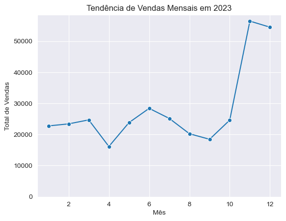
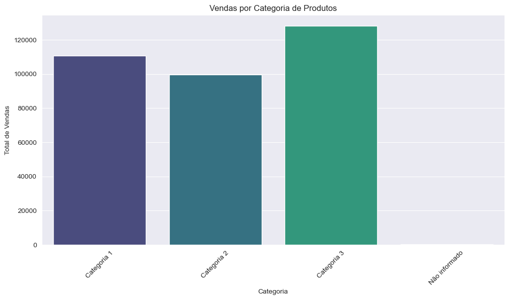

# Teste Analytics

O projeto está dividido em três partes, cada uma contendo suas próprias pastas e arquivos:

## Parte 1: Programação em Python
Esta parte envolve a simulação, limpeza e análise de dados de vendas.

  - `analise_exploratoria_vendas_2023.ipynb`: Notebook Jupyter contendo a simulação do dataset, limpeza de dados, análises e visualizações.
  - `data_clean.csv`: Dataset limpo resultante do processo de limpeza.

### Descrição dos Dados
Os dados de vendas estão armazenados no arquivo `data_clean.csv`. Este arquivo contém as seguintes colunas:
- `ID`: id da venda.
- `produto`: nome do produto.
- `data`: Data da venda.
- `categoria`: Categoria do produto vendido.
- `preço`: preço do produto.
- `total_vendas`: Valor total das vendas.

## Análises Realizadas
### Análise Descritiva
- **Estatísticas Descritivas:** Resumo das estatísticas principais dos dados.
- **Distribuições de Vendas por Mês:** Análise das vendas mensais.

### Análise de Tendências Sazonais
- **Gráficos de Linha para Tendências Mensais:** Identificação de picos e vales nas vendas.

### Análise de Categorias de Produtos
- **Vendas por Categoria:** Identificação das categorias mais vendidas.

## Exemplos de Visualizações
### Distribuição das Vendas por Mês



### Tendências de Vendas Mensais


## Parte 2: SQL
Esta parte consiste em escrever consultas SQL com base nas tabelas geradas na Parte 1.

  - `consultas_sql.sql`: Arquivo contendo as consultas SQL para listar produtos, categorias e a soma total de vendas, além de identificar os produtos que venderam menos no mês de junho de 2024.

## Parte 3: Interpretação de Resultados
Nesta parte, é necessário escrever um breve relatório resumindo os principais insights encontrados nas análises realizadas nas Partes 1 e 2.
-  `relatorio_insights.pdf`: Relatório com a interpretação dos resultados e sugestões de ações baseadas nos insights encontrados.

## Como Executar os Scripts

### Parte 1: Programação em Python
1. Clone o repositório para sua máquina local:
   ```sh
   git clone https://github.com/Mathee-us/Teste_Analytics_MatheusRodriguesFerreira.git
   ```
2. Navegue até o diretório da Parte 1:
   ```sh
   cd Parte 1 Programação em Python
   ```
3. Instale as dependências necessárias:
   ```sh
   pip install pandas seaborn matplotlib jupyter
   ```
4. Abra o notebook Jupyter:
   ```sh
   jupyter notebook analise_exploratoria_vendas_2023.ipynb
   ```
5. Execute as células do notebook para gerar o dataset simulado, limpar os dados e realizar as análises.

### Parte 2: SQL
1. Navegue até o diretório da Parte 2:
   ```sh
   cd ../Parte 2 SQL
   ```
2. Utilize um banco de dados SQL para executar as consultas do arquivo `consultas_sql.sql`.

### Parte 3: Interpretação de Resultados
1. Navegue até o diretório da Parte 3:
   ```sh
   cd ../Parte 3 Interpretação de Resultados
   ```
2. Abra o arquivo `relatorio_insights.pdf` para visualizar o relatório com a interpretação dos resultados.


